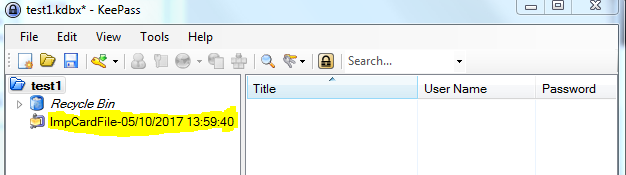

# CardFileKPPlugin
##
## Summary: A plugin for Keepass.  It imports a Microsoft Cardfile.

The plugin adheres to the Keepass 2.x interface and was written in C# v6.

The MS Cardfile ([Cardfile](http://wikivisually.com/wiki/Cardfile)) is an old app from Windows NT and previous times which is however still in use today in a few cases.  The app was bundled in with the OS, and provided a simple GUI and 'database' in the manner of a manual indexed card file.  One approach to using it as a password managers was to store login details and keep the cardfile inside an encrypted wrapper of some sort.  The MS app did not provide a means of exporting the data held within it.  This plugin provides a means of importing the Cardfile data into [Keepass](https://keepass.info/).

At each import, the plugin creates a new Keepass group, whose name (ImpCardFile-<date/time>) includes the date and time, and puts all data read into the group, with each Card index text appearing as a an Entry Title, and the card contents appearing as an Entry Note.

This plugin uses the CardFileRdr.dll assembly from [CardFileRdr](http://github.com/antboy/CardFileRdr), which does the actual reading of the MS Cardfile.

A limitation of the CardFileRdr.dll is that it ignores contained OLEs and graphic objects such as bitmaps, which are theoretically allowed, so reads only the text contents, but it will process Unicode correctly.

The plugin adheres to Keepass's update checking facility that provides notification of new version availability.  A signed version file is held in the repository and the URL passed to Keepass by the plugin at run-time.  The signature consists of a SHA-512 hash of the file which is encrypted by a private key, converted to a Base64 string and then added to the version file.  The plugin .plgx file contains the public key with which to decrypt the hash for verification, but this key is not given in the source code as anyone building from it will wish to substitute their own.

## Installation
The plugin is made available as a Keepass .plgx file (CardFileKPPlugin.plgx) and is installed by simply downloading it from the repository Release, then copying it to the Keepass plugins directory (e.g. C:\Program Files (x86)\KeePass Password Safe 2\Plugins).

The SHA-256 hash of the plugin is:
7dd11d56813e01d6002eea7c04870a9d06a7f41200d22ded40a91b3cba325d39

##
## How to Use
From Keepass' File menu, select Import...

which causes the display of the *Import File/Data* dialogue...

Scroll down the list of *Password Managers* until you see the entry for *Microsoft Cardfile*, and select it ...

----------

and in the *Files to be imported* box, enter (e.g. using the browse button to the right of it) the path & name of the file containing the cardfile to be imported, and press the OK button.

When the import is complete, you will see in your Keepass database a new group whose name ImpCardFile-<> includes the date and time of creation.  Clicking on the group will cause Keepass to display the list of new entries created inside it.  Don't forget to click Save!

